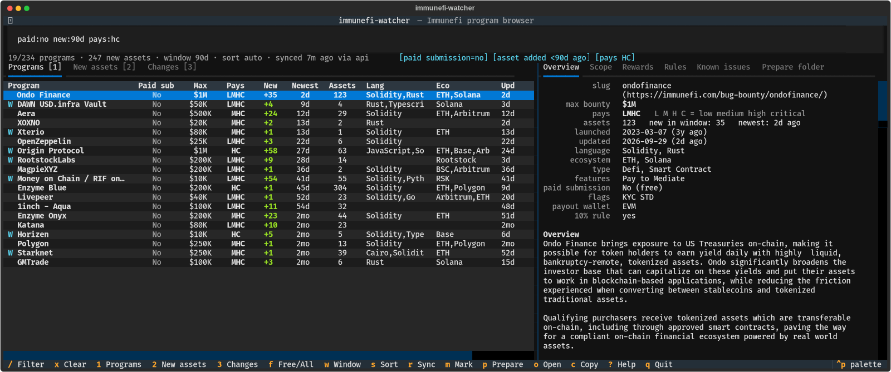

# immunefi-watcher

A local database and interactive terminal UI for Immunefi bug bounty programs. It pulls every program's scope,
rewards, rules, known issues and audits into SQLite, lets you filter them live, shows which programs added new
assets recently, and prepares a `<program>/SCOPE.md` folder with one key press.

Built to answer one question quickly: which program should I hunt next?

It only reads Immunefi's public endpoints. Nothing is sent anywhere.

Scope of this tool is the smart contract and blockchain side of programs. Web and app (web2) scope, rewards and
rules are deliberately left out, with only a marker showing that a program also has a web side (see
[Web2 handling](#web2-handling)).

---



## Install

Requires Python 3.10 or newer and a terminal with colour support.

```bash
git clone https://github.com/smrayyans/immunefi-watcher.git
cd immunefi-watcher
python3 -m venv .venv && .venv/bin/pip install -r requirements.txt
bin/iw              # opens the interactive UI (syncs automatically on first launch)
```

Optional shell alias, in `~/.bashrc` or `~/.zshrc`:

```bash
alias iwatch="/full/path/to/immunefi-watcher/bin/iw"
```

The examples below use `iwatch`; `bin/iw` does the same. The alias is named `iwatch` rather than `iw` because
`/usr/sbin/iw` is the Linux wireless tool and an `iw` alias would hide it.

## Quick start

Typical session:

1. Run `iwatch`. It syncs by itself if the data is more than 4 hours old. Press `r` any time to sync manually.
2. The list opens on free-to-submit programs (`paid:no`). Press `f` to toggle between those and all programs.
3. Press `2` for the feed of newly added assets, newest first. Press `w` to widen the window (1d, 3d, 7d, 14d, 30d, 90d).
4. Press `/` and type filters to narrow down, for example `pays:hc new:30d asset:contract`.
5. Move through the list. The right pane shows the program. Use `[` and `]` to switch its tabs.
6. Press `m` to mark a program (hunt, skip, done).
7. Press `p` on the program you pick. It creates `<program>/SCOPE.md` and `targets.txt` next to the tool's folder.

No cron job or background process is used. The tool only runs while you have it open.

---

## The main table

The Programs view (key `1`) has one row per program.

| Column | Meaning |
|---|---|
| (name) | Program name. A cyan **W** before it means the program also has a web/app side. Your mark colours the name and adds a glyph after it: green with `▶` is hunt, dim red struck through with `✗` is skip, cyan with `✓` is done. |
| **Paid sub** | `Yes` (yellow) if the program has Immunefi's **Pay to Submit** feature, `No` if submitting is free. This is the `$` badge next to the program name on Immunefi's page. |
| **Max** | Highest published reward on the smart contract / blockchain side. |
| **Pays** | Letters for the severities the program pays for. See below. |
| **New** | Count of assets added inside the current window (default 7 days). Green `+N`. When you use a `new:` or `asset:` filter, it counts the assets matching the filter. |
| **Newest** | How long ago the most recent asset was added to scope. |
| **Assets** | Number of smart contract / blockchain assets in scope. |
| **Lang** | Languages of the program (Solidity, Rust, and so on). |
| **Eco** | Ecosystems (ETH, Solana, Arbitrum, and so on). |
| **Upd** | How long ago Immunefi last updated the program record. |
| **Flags** | `KYC` (KYC required for payouts), `STD` (Immunefi Standard program), `INVITE` (invite only), `PAUSED`. |

Paid sub, Max, Pays, New, Newest and Assets are centred under their headers.

Programs with `-` in Pays always sort to the bottom of the list, whatever the sort order. They have no reward table
(mostly audit competitions and pool-based programs).

### What the Pays letters mean (L M H C)

Each letter is a severity. They always appear in this order, all caps:

| Letter | Severity |
|---|---|
| `L` | Low |
| `M` | Medium |
| `H` | High |
| `C` | Critical |

A letter is shown when the program pays for that severity. A missing letter means the program does not pay for it.
It makes no difference whether the payout is a range, an up-to value or a fixed amount: pay is pay.

Examples:

| Pays | Meaning |
|---|---|
| `LMHC` | Pays for all four severities. |
| `MHC` | Pays for Medium, High and Critical. No payment for Low. |
| `HC` | Only High and Critical are paid. Lows and mediums get nothing. |
| `C` | Only Critical is paid. |
| `-` | No reward table in the data. |

This comes from Immunefi's reward table for the program's smart contract and blockchain assets. Check it against the
program page when it matters. For example, 0x shows `MHC` here and on its page.

You can filter on it: `pays:hc` means programs that pay High and Critical, `-pays:l` means programs that do not pay
Lows, `pays:lmhc` means all four.

### Web2 handling

Many programs have a separate web/app program with its own payout structure. This tool does not show any of it:
web assets, web reward rows, web impacts and web PoC rules are removed from the lists, the Scope, Rewards and Rules
tabs, the New assets feed, the change events and the generated `SCOPE.md`. Asset counts, Pays and Max describe the
smart contract / blockchain side only.

The only trace is the cyan **W** before the program name, plus the filter `web:no` (hide those programs) or
`web:yes` (only those). Programs that are web-only keep a row, show `-` for Max and Pays, and sink to the bottom.

---

## Views and tabs

Left side, switch with `1` `2` `3`:

- **Programs**: the table above.
- **New assets**: a flat feed of assets added recently, newest first, with program, Paid sub, Max, type and URL.
  The window is 7 days unless you set one with `new:` or press `w`.
- **Changes**: what changed between syncs (see [Change tracking](#change-tracking)).

Right side detail pane for the selected row, switch with `[` and `]`:

- **Overview**: slug, max bounty, Pays, asset counts, launch and update dates, language, ecosystem, features, Paid
  submission, flags, payout wallet, 10% rule, links, your mark, and the program overview text.
- **Scope**: every asset, newest first, with its added date. Assets inside the window are marked NEW. In the New
  assets view the asset you selected is highlighted.
- **Rewards**: the reward table (severity, asset type, min, max, model) and the reward details text. A fixed payout
  with no stated amount shows "see rules".
- **Rules**: out of scope, prohibited activities, feasibility limits, prioritized vulnerabilities and the impacts
  table.
- **Known issues**: known issues listed by the program, plus audit reports.
- **Prepare folder**: creates the program folder (see [Prepare folder](#prepare-folder)).

---

## Keys

| Key | Action |
|---|---|
| `/` | Focus the filter bar. `Enter` or `Esc` returns to the list. |
| `x` | Clear the filter completely. |
| `f` | Toggle free-to-submit only (`paid:no`). This is the default at startup. |
| `1` `2` `3` | Programs, New assets, Changes. |
| `n` | Jump to the New assets feed. |
| `w` | Cycle the new-asset window: 1d, 3d, 7d, 14d, 30d, 90d. |
| `s` | Cycle the sort: bounty, pool, new, newest, updated, launch, assets, name. |
| `r` | Sync now. |
| `m` | Mark the program: hunt, then skip, then done, then none. |
| `p` | Prepare folder for the selected program. |
| `o` | Open the selected asset (New assets view) or the program page in your browser. |
| `O` | Open the program page. |
| `c` | Copy the asset URL (New assets view) or the program page URL. |
| `[` `]` | Previous or next detail tab. |
| `z` | Hide or show the detail pane. |
| `?` | Help. |
| `q` | Quit. |

`w` and `s` work by rewriting `new:` and `sort:` in the filter bar, so the bar always shows exactly what is applied.

Cycling the detail tabs with `]` passes over **Prepare folder**, which prepares the selected program (see below).

---

## Filter language

Type in the filter bar (`/`). It applies as you type, and the line under the bar shows how it was understood.
Conditions are combined with AND. `a,b` means a OR b. A leading `-` negates a condition. Plain words match the
program name, slug and tags.

| Filter | Meaning |
|---|---|
| `new:7d` | Assets added within 7 days (units: `h`, `d`, `w`, `mo`, `y`). Bare `new:` means 7d. Alias `added:`. |
| `bounty:>=100k` | Max bounty. Also `min:100k` and `max:1m`. Suffixes `k`, `m`, `b`. Operators `>`, `>=`, `<`, `<=`, `=`. |
| `pays:hc` | Pays for these severities (letters L M H C, any order). `-pays:l` means no Lows. |
| `paid:no` | Free to submit. `paid:yes` means Pay to Submit programs. Alias `pts:`. |
| `web:no` | Hide programs that also have a web/app side. `web:yes` shows only those. |
| `pool:` | Has a prize pool. `pool:>1m` compares the total pool (pools may be in tokens, not dollars). |
| `lang:solidity,rust` | Language. |
| `eco:eth` | Ecosystem (alias `chain:`). |
| `type:defi` | Project category. |
| `ptype:contract` | Program type. |
| `feature:triage` | Immunefi feature text, for example `triage`, `arbitration`, `vault`, `boost`. |
| `token:usdc` | Reward token. |
| `asset:contract` | Asset type: `contract`, `web`, `chain`. Applies to the asset feed and to which programs match. |
| `url:github.com/foo` | Match asset URLs and descriptions. |
| `assets:>50` | Number of assets in scope. |
| `age:<90d` | Launched less than 90 days ago. Without an operator it means older than. |
| `updated:<7d` | Record updated within 7 days. |
| `kyc:no` `std:yes` `invite:no` | Flags. |
| `paused:any` | Include paused programs (hidden by default). `paused:yes` shows only paused. |
| `mark:hunt` | By your mark: `hunt`, `skip`, `done`, `none`. `-mark:skip` hides skipped programs. |
| `sort:bounty` | Sort by `bounty`, `pool`, `new`, `newest`, `updated`, `launch`, `assets`, `name`. |

Examples:

```
new:14d asset:contract lang:solidity bounty:>=100k -mark:skip sort:newest
paid:no pays:hc -pays:l web:no
age:<60d pays:mhc
url:github.com/aave
feature:triage eco:eth,arbitrum kyc:no
```

A typo shows in red in the status line, for example `unknown filter 'foo'` or `pays: use letters L M H C`.

---

## New asset tracking

This is the main feature. Every asset in Immunefi's data carries an `addedAt` timestamp, so recent additions are
known from the very first sync. There is no history to build up first.

- The New assets view lists every asset added inside the window, newest first.
- The **New** and **Newest** columns summarise it per program.
- `new:30d` (or `w`) widens the window. The default is 7 days.
- Later syncs also record `asset_added` events, so you can see when an asset appeared even if you check late.

Assets whose `addedAt` is missing fall back to the time the tool first saw them.

---

## Change tracking

Each sync compares Immunefi's data with what is stored and records events. The first sync only sets the baseline
and records no events. The Changes view (`3`) and `iw events` list them:

| Event | When |
|---|---|
| `new_program` | A program appeared in the directory for the first time. |
| `program_removed` / `program_returned` | A program left or came back. |
| `paused` / `unpaused` | The paused flag changed. |
| `asset_added` / `asset_removed` | A smart contract / blockchain asset entered or left scope. |
| `bounty_changed` | Max bounty changed. |
| `pool_changed` | A prize pool changed. |
| `tiers_changed` | The Pays letters changed, for example a program started paying Lows. |
| `policy_changed` | Rules text changed. It names which part: known issues, out of scope, rewards, impacts, audits, and so on. |

Web and app changes are not tracked. A sync that returns fewer than half of the tracked programs is refused, so a
partial API failure cannot mark everything as removed.

Because there is no scheduler, changes between two syncs are shown as one difference. If something changes and then
changes again before your next sync, you see only the net result. New assets are not affected by this, since they come
from `addedAt`.

---

## Prepare folder

Opening the **Prepare folder** tab, pressing `p`, or running `iwatch prepare <slug>` creates a folder for the
selected program in the parent directory of this project (override with `IW_PROGRAMS_DIR`), named after the
program slug in lowercase (for example `onre/`), with:

- `SCOPE.md`, a single Markdown scope document. It contains: provenance line, program facts (live
  date, KYC, max bounty, reward token, tiers, 10% rule, PoC requirements, Paid submission, features, pools,
  language, ecosystem, links), overview, all smart contract / blockchain assets grouped by type with added dates and
  a **NEW** tag for the last 30 days, the rewards table and reward details, impacts in scope by severity, out of
  scope and prohibited activities, rules, known issues, audits, and an `Economics` block (`max_payout_usd`,
  `audit_count`, `days_since_listing`, `fork_of`, `pays_criticals`, `pay_to_submit`).
- `targets.txt`, pointing at the program folder. It is only created if missing.

Rejection rules are not generated, because those are your own analysis.

**Existing SCOPE.md is never silently changed.** If one already exists, a popup asks:

| Choice | Key | Result |
|---|---|---|
| Keep existing (default) | `k`, `Esc` or `Enter` | Nothing changes. |
| Save as SCOPE.new.md | `n` | A fresh copy is written beside yours to compare. |
| Overwrite | `o` | Your file is first copied to `SCOPE.md.bak-<date-time>`, then replaced. |

If the folder exists but has no `SCOPE.md`, the file is simply written. Scrolling to another program while the tab is
open does not create anything. Only opening the tab or pressing `p` does.

Command line: `iwatch prepare <slug> [--force-new | --overwrite [-y]] [--dir PATH]`. `--overwrite` asks "Overwrite
it? [y/N]" unless you pass `-y`, and always saves the backup.

---

## Command line

```bash
iwatch                                   # interactive UI
iwatch sync [--source auto|api|github]   # refresh data, print what changed
iwatch ls [filters...] [-n 40] [--json|--csv]
iwatch new [filters...] [-d 7d] [-n 60] [--json]
iwatch show <slug> [-s overview|scope|rewards|rules|known] [-w 7d]
iwatch events [--since 7d] [--kind KIND] [--slug SLUG] [-n 100]
iwatch mark <slug> hunt|skip|done|clear [note...]
iwatch prepare <slug> [--dir PATH] [--force-new | --overwrite [-y]]
```

Examples:

```bash
iwatch ls new:7d "bounty:>=100k" pays:hc --json
iwatch new -d 3d paid:no
iwatch show 0x -s rewards
iwatch events --since 3d --kind asset_added
iwatch mark aave hunt "looking at v3 rewards"
```

In zsh, put quotes around any filter containing `>` or `<`, otherwise the shell treats it as a redirect.
The CLI does not apply the UI's default `paid:no` filter.

---

## Syncing

- The UI syncs automatically on launch when the last sync is more than 4 hours old (`AUTO_SYNC_HOURS` in `iw/tui.py`).
- Press `r` any time. It is safe to press repeatedly. It does nothing while a sync is already running.
- `iwatch sync` does the same from the command line.
- The source is Immunefi's public directory (`immunefi.com/public-api/bounties.json`), which returns every program
  with its full record in one request. If it fails, the tool falls back to the infosec-us-team GitHub mirror of the
  same data. If both fail you get an error popup and your existing data stays untouched.
- The status line shows when the last sync happened and which source was used.

There is no cron job or timer. If you want one later, run `iwatch sync` from your own scheduler.

---

## Data, settings and files

| Item | Where |
|---|---|
| Database | `~/.local/share/immunefi-watcher/iw.db` (override with `IW_DB`). Holds programs, assets, change events, sync history and your marks. |
| Program folders | The directory that contains this project's folder (override with `IW_PROGRAMS_DIR`). |
| Startup filter | `DEFAULT_FILTER = "paid:no"` in `iw/tui.py`. |
| Auto-sync age | `AUTO_SYNC_HOURS = 4` in `iw/tui.py`. |
| Column widths | `PROG_COLS`, `FEED_COLS`, `EVENT_COLS` in `iw/tui.py`. |
| Web marker | `WEB_MARK = "W"` in `iw/view.py`. |

The database upgrades itself when the tool is updated (tracked with SQLite `user_version`), recomputing derived
columns from the stored records so no false change events appear.

Project layout:

```
bin/iw            launcher (uses the project's own .venv)
iw/cli.py         command line
iw/tui.py         interactive UI (Textual)
iw/query.py       filter language, loading programs from the database
iw/view.py        rendering for the detail tabs and CLI tables
iw/sync.py        fetch, diff and change events
iw/prepare.py     SCOPE.md and folder generation
iw/db.py          SQLite schema and migrations
iw/util.py        time, money, severity letters, web/app stripping
```

Dependencies: Python 3.10 or newer, `textual` and `httpx` (installed in `.venv`). To rebuild the environment:

```bash
python3 -m venv .venv && .venv/bin/pip install -r requirements.txt
```

---

## Limits and things to know

- **No payout history.** Immunefi's data does not say whether a program has actually paid researchers. `STD`,
  `feature:triage` and program age are only rough proxies.
- **Paid sub** is mapped from the Immunefi feature `Pay to Submit`, which matches the `$` badge on programs like
  Ethena. If you find a program where the badge and the column disagree, that is a bug to report.
- **Max** is the highest published reward on the smart contract / blockchain side. Immunefi gives a single
  top-level maximum that can come from the web side, so for programs with a web side Max is recomputed from the
  smart contract rows. Where the rows give no amount (fixed payouts), the top-level number is kept unless the web side
  publishes its own amount.
- **Pools** can be denominated in the reward token rather than dollars. The Rewards tab shows the token next to the
  number, and there is no Pool column in the table.
- **Dates** are Immunefi's `addedAt` and `updatedDate`. Always confirm scope on the live program page before testing
  anything. Programs change.
- **Reward text** (the long description of how rewards are calculated) is shown as written. It is not parsed, and
  may still mention web assets.
- **Mouse and copying text.** The app captures the mouse. In Konsole, hold Shift while dragging to select text
  normally. `c` copies the URL.
- **Narrow terminals.** Column widths are fixed, so on a narrow window the table scrolls sideways instead of
  squeezing columns. Press `z` to hide the detail pane and get the full width.
- **`iw` versus `iwatch`.** Use `iwatch`. Plain `iw` is the system wireless tool.

---

## License

MIT, see [LICENSE](LICENSE). This is an unofficial tool and is not affiliated with Immunefi. It reads Immunefi's
public, undocumented directory endpoint, which can change without notice.
